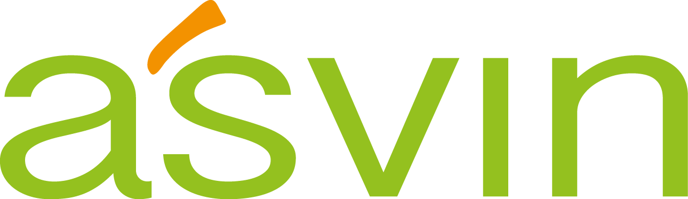

.. note:: Please make sure you are looking at the documentation that
	  matches the version of the software you are using. See the
	  version label at the top of the navigation panel on the left.
	  You can change it using selector at the bottom of that
	  navigation panel.

Risk by Context
===============

An Enterprise-grade Cyber security Risk management solution.

.. toctree::
   :maxdepth: 1

   introduction
   key-concepts
   getting-started/getting-started
   tutorials/tutorials
   security/security
   rest-apis
   contribution/contribution
   glossary
   releases/releases