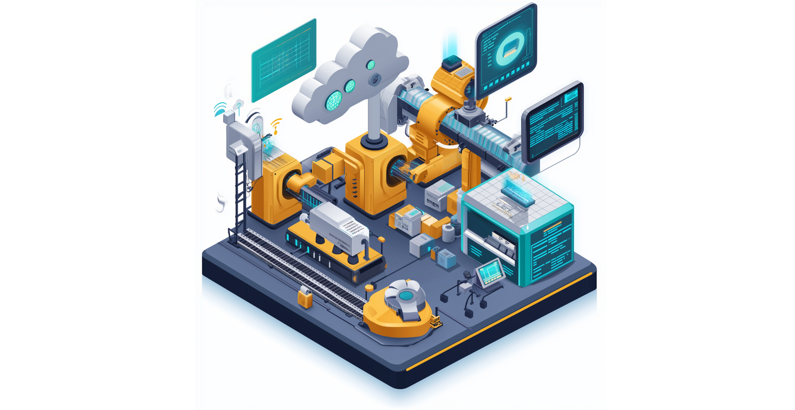
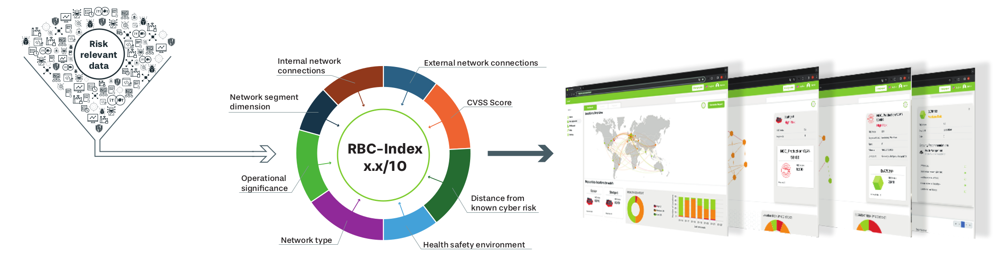

=============
Introduction
=============
Operational Technology (OT) refers to the hardware and software systems used to monitor, control, and manage physical processes and infrastructure in industries such as manufacturing, energy transportation, and utilities. OT is composed of devices like Industrial Control Systems (ICS Supervisory Control and Data Acquisition (SCADA) systems, Distributed Control Systems (DCS), and Industrial Internet of Things (IIoT) devices, all of which directly interact with machinery and physical assets. As OT systems become more interconnected with IT networks, they face a growing range of cybersecurity risks. These include vulnerabilities in legacy systems, exposure to ransomware, unauthorized remote access, and threats from malware. Attack vectors can include phishing to gain initial access, supply chain attacks to introduce malicious code, or exploiting weak network segmentation to pivot into OT environments. Such attacks can result in service disruptions, financial losses, and even physical damage to critical infrastructure.

Cybersecurity Landscape in OT
-----------------------------
The threat landscape of OT has expanded significantly with the integration of Internet of Things (IoT) devices, cloud services, Artificial Intelligence (AI), and increased interaction with traditional Information Technology (IT) systems. IoT devices, often lacking robust security features, serve as entry points for attackers targeting critical infrastructure. The adoption of cloud services for data storage and remote monitoring introduces risks related to unauthorized access and data breaches. AI, while enhancing operational efficiency can be exploited for sophisticated attacks like deepfake social engineering or automated system disruptions. Furthermore, the convergence of IT and OT networks blurs traditional security boundaries, enabling cyber threats to move laterally between systems. This interconnected environment increases vulnerabilities, making OT systems more susceptible to ransomware, malware, and espionage, posing significant risks to operational continuity and safety.

Key Cybersecurity Risks in OT Environments

1. **Increased IoT and Industrial Connectivity**

The widespread deployment of IoT sensors, smart devices, and networked Industrial Control Systems (ICS) has expanded the number of potential entry points for cyberattacks. Many of these devices lack robust security features, making them susceptible to unauthorized access and exploitation.

2. **Cloud Adoption and Remote Access**

The shift to cloud-based architectures for real-time monitoring, predictive maintenance, and AI-driven automation has introduced security concerns, including misconfigurations, data breaches, and unauthorized remote access. Cyberattacks targeting cloud environments can compromise critical OT infrastructure.

3. **Legacy OT Systems with Weak Security**

Many OT systems operate on outdated and unpatched software, originally designed without cybersecurity considerations. These legacy systems often lack encryption, multi-factor authentication, and real-time monitoring, making them vulnerable to attacks.

4. **IT-OT Integration and Expanded Attack Surface**

With IT and OT networks becoming more interconnected, the traditional security perimeter is no longer sufficient. Cyber threats that originate in IT environments can propagate to OT networks disrupting industrial operations and critical processes.

5. **Supply Chain and Third-Party Risks**

OT environments frequently rely on third-party vendors for software, hardware, and maintenance services. Compromised vendors or supply chain vulnerabilities can introduce malware, backdoors, or other security risks into industrial networks.

6. **Ransomware and Industrial Espionage**

Ransomware attacks targeting critical infrastructure and OT environments have increased. Cyber criminals exploit IT-OT inter-connectivity to encrypt industrial control systems, often demanding ransom for system restoration. Additionally, nation-state actors and corporate espionage pose threats by targeting intellectual property and operational data.

7. **AI-Powered Threats and Automation Risks**

While AI enhances automation and decision-making, adversarial AI techniques can be used to manipulate industrial control data, bypass security mechanisms, and disrupt machine-learning-driven automation. A compromised AI model can result in incorrect operational decisions, leading to equipment failure or safety hazards.

IT Protects Data, OT Protects Lives: The Real Difference in Cybersecurity
-------------------------------------------------------------------------
OT risk management differs fundamentally from IT risk management due to the unique priorities environments, and consequences involved. While IT security primarily focuses on data confidentiality, integrity, and availability, OT security prioritizes safety, reliability, and operational continuity. Unlike IT systems, where downtime is often acceptable for updates and security patches, OT environments—such as manufacturing plants, power grids, and transportation systems—require continuous uptime making traditional security measures like frequent patching or system restarts impractical Additionally, legacy OT systems were not designed with cybersecurity in mind, making them more vulnerable to attacks and harder to secure without disrupting operations. The integration of physical processes in OT also means that cyber threats can lead to real-world consequences, including equipment damage, environmental hazards, and even threats to human safety. These factors necessitate a specialized approach to OT risk management.

The CVSS Trap
-------------
Existing OT risk management solutions face significant limitations, particularly with traditional vulnerability scanning tools. These tools generate extensive lists of vulnerabilities, leaving security managers overwhelmed and struggling to prioritize risks effectively. To manage this, many rely on Common Vulnerability Scoring System(CVSS) or similar scoring methods. However, these approaches are often ineffective because they lack critical context, such as the operational importance of affected systems or real-world exploitability. Additionally, CVSS scores are static,meaning they do not adapt to evolving threats, emerging attack techniques, or system-specific defenses. Lastly, they are one-dimensional, focusing only on technical severity without considering business impact, threat intelligence, or compensating controls. As a result, security teams may allocate resources inefficiently, overlooking critical threats while addressing less relevant vulnerabilities.

Risk by Context™ - Unveil the unseen
------------------------------------
The risk-by-context approach by asvin introduces a transformative method for OT risk management addressing the limitations of traditional vulnerability scoring. Instead of relying solely on static severity metrics, it integrates critical contextual factors such as operational significance business impact, network segmentation, health and safety index, and business continuity plans to build a cyber risk knowledge graph. By leveraging advanced graph technologies, this approach establishes relationships between assets, vulnerabilities, and threats, enabling the generation of a multi-dimensional, dynamic risk score called the RBC-Index. Unlike conventional CVSS-based methods, the RBC-Index continuously evolves, adapting to real-time changes in the OT environment and prioritizing risks based on their true impact. This context-driven approach ensures that security teams can allocate resources more effectively, focusing on vulnerabilities that pose the most significant operational and safety risks. By bridging the gap between cybersecurity and OT operations, Risk by Context™ solution enables smarter, data-driven decision-making, reducing downtime, enhancing resilience, and proactively mitigating threats to critical frastructure.

